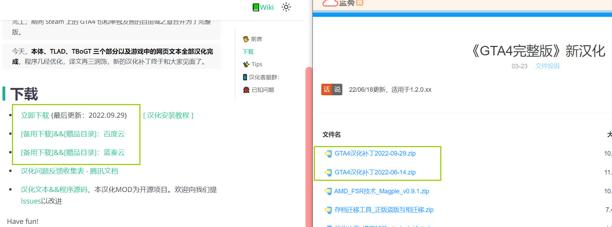

# 0：安装前准备

## 0.5 正版游戏自动安装
>以下为2022.09.29汉化补丁专属安装教程👇：

1. 运行一次原版游戏，确定游戏能够正常运行。 
如果曾为Steam版安装过降级汉化或是其他需要降级的Mod，请进入游戏根目录删除所有文件，验证完整性重下游戏。避免降级汉化引入的多余文件影响正常游戏。
1. 将汉化包解压至任意文件夹。
2. 双击**正版游戏自动安装(先至少运行一次游戏).bat**，提示**完成！**后关闭该窗口。

**若无法自动安装或安装失败**，请打开汉化包中的「release」文件夹，将里面的所有文件和文件夹复制粘贴到游戏根目录 (gtaiv.exe所在文件夹)。操作步骤见下

3. 启动游戏，在**选项 - 显示**中将**字幕**设置为**开**。

## <input type='checkbox' /> 1. 解压缩
> 以下为2022.06.14汉化补丁安装教程👇

请先确认电脑拥有解压文件的能力。使用Windows 7及以上系统时，自带对.zip压缩文件的处理能力。但此教程仍推荐你使用[第三方解压缩软件](https://www.bandisoft.com/bandizip/)。

## <input type='checkbox' /> 2. 最新的《GTA4完整版》 
无论是在Steam、RGL购买或是网络下载得来的学习版，都必须保持游戏版本号在1.2.0.xx之上

查看版本号的方式：

> **拒绝任何升级得来的游戏，必须全新下载**

## <input type='checkbox' /> 3. 汉化补丁
电脑上已经存在从本站或其他来源下载的[《GTA4完整版》新汉化补丁](../intro.md#下载)

> **`达成三项后方可继续浏览下一页`**